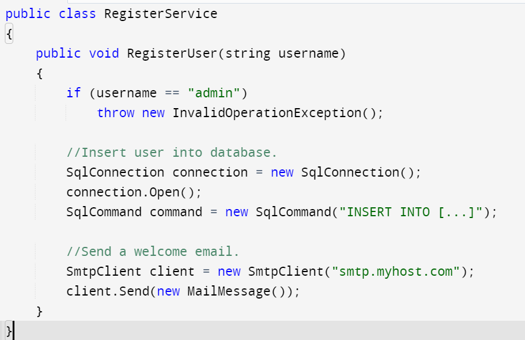
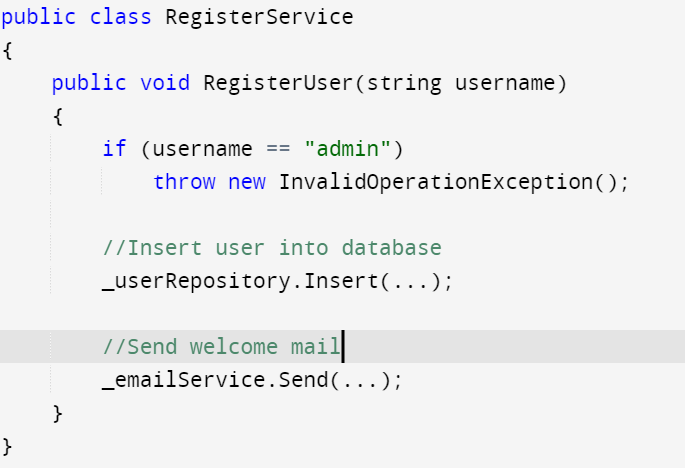
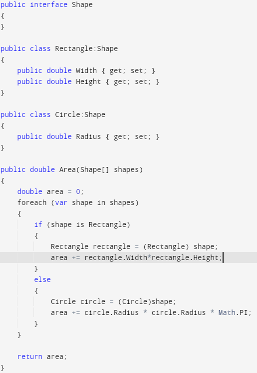
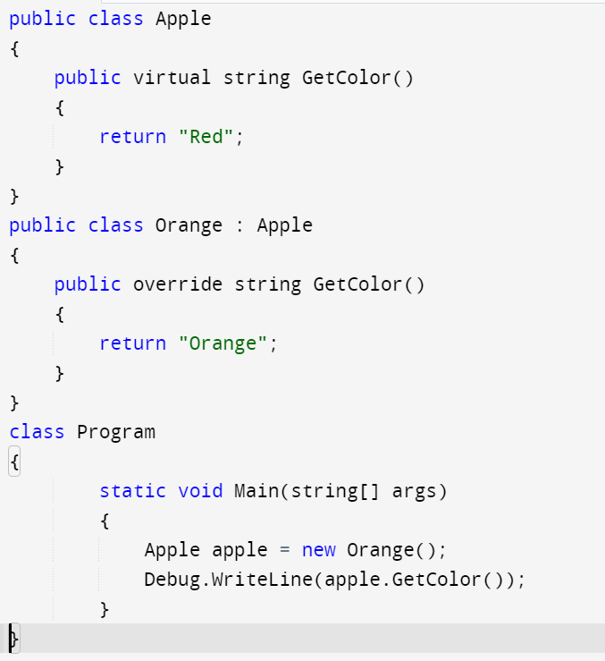
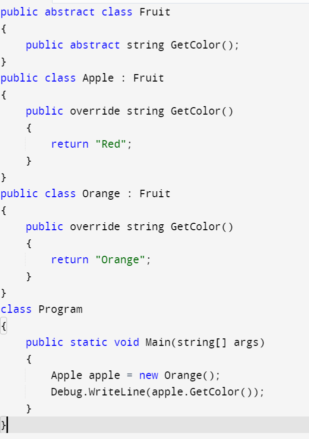

# Backend architectures (N-layered, DDD, Hexagon, Onion) evolution

In the prehistoric .NET/ ASP.net world, we wanted to **split the business logic from presentation** and depending on the UI framework, different MVC-like patterns were born,

These are self-explanatory in the picture above, however one important thing to note here is that

**Model here stands for Domain Model**, also known as business logic, which is quite crucial in any application.

So basically the model consists of 
1. Entities or Data Model, or simply DTOs
2. The Business logic
3. The Services
4. The DB interaction layer

So a lot of complexity is built into the Model layer.

## N-Layered architecture by Martin Fowler, circa 2002

Martin Fowler, published "Patterns of Enterprise Application Architecture", in 2002 describing the N-layered architecture, which broadly states

**Group all related code together and call those layers**.
   1. you can name layers the way you want
   2. you can have as many layers as you need
   3. you can add layers in between 
   4. you can have multiple components in the same layer 
   
**Just make sure there is a clear hierarchy between layers in a way they are referencing each other one by one**

So broadly, we need 3 layers for most of our projects

* User Interface - interacts with users
* Business Logic Layer - the core of the application, the logic and control driving this application
* Data Access Layer - stores the data in memory/DB and also the state of the application. And also all external technologies go in this layer, notification( emails) etc.

So each layer calls the one below it by its API, which is usually represented in the form of an interface and  
**project dependencies are targeted in one direction.**  
eg. UI cant interact with DAL without going through BL layer

## Domain Driven Design by Eric Evans, circa 2003

Eric Evans published his book "Domain-Driven Design: Tackling Complexity in the Heart of Software" which 
* broadly agrees with Fowler's idea that project dependencies should be targeted in one direction.
* but it is fine for low-level modules to call the ones above, using callbacks, observer patterns, such that it doesnot break the dependency direction rule

Also, he said that
* User Interface can be renamed into more generic **Presentation**, which also now covers, GUI, CLI as well as APIs to the system 
* Business Logic which consists of **Controller** and **Domain Model** can be separated into **Application** and **Domain**
  * Domain Layer — represents concepts of the business. 
  * Application Layer — coordinates tasks and delegates work to domain objects.
* DataAccess is renamed to **Infrastructure**: stores the data in memory/DB and also the state of the application. And also all external technologies go in this layer, notification( emails) etc.

and Domain becomes the centerpiece of our architecture

Domain-Driven Design (DDD) focuses on modeling the core business domain and aligning software design with the **concepts and processes within that domain**. It emphasizes close collaboration between domain experts and developers to establish a shared language and understanding.

DDD introduces the concept of bounded contexts, which divide a large software system into smaller, more manageable contexts with their own models, rules, and ubiquitous language. This allows teams to work independently on different parts of the system.
eg.
* **Banking System**: A banking system can define bounded contexts such as "Account Management" and "Transaction Processing". Each bounded context has its own domain models, rules, and ubiquitous language. The "Account Management" context may have entities like Account and Customer, while the “Transaction Processing” context may have entities like Transaction and Transfer. This separation allows different teams to work independently and ensures clear understanding within each context.

## Hexagon Architecture (Ports and Adapters), by Alistair Cockburn, circa 2005

In the above architectures, the layer above always has a reference to the next one in line. So, we can-not freely change the DAL layer without effecting the bussines logic.  
However, with the principle of Dependency Inversion, this becomes much more flexible  

So instead of the layer above holding a reference to the layer below, we have   
* a **Core**, previously the **Domain layer and Application Layer** which is the central component of the system. It does not have a reference to any other layers/components
* the Infrastructure modules were split into **abstraction (interfaces)** and **implementation**. 
  * Abstractions become part of Business logic and are called **ports**
  * Implementations are now called **adapters**
* Presentation also goes through the same split

In effect the domain becomes autonomous and dependency-free, since that is the only non-changing entity.  
Your Databases can change, your UI can change (or be extended to REST API, desktop app etc), as long as it is using the **interfaces(or ports)** exposed by the **business logic, the domain, the core** 

* adapters that call our system called primary (driving). 
* Those that are called by our system are called secondary (driven).

### More on Dependency Inversion and Dependency Injection

The dependency inversion principle states that **high-level modules should depend on abstractions rather than concrete implementations**.   
This helps decouple the high-level and low-level modules, making it easier to change the low-level ones without affecting the high-level ones.

Dependency injection is simply the technique that allows us to decouple high-level modules from low-level modules by providing an abstraction for the low-level modules

## Onion Architecture, by Jeffrey Palermo, circa 2008

Onion architecture, further consolidates the Core or Domain as the central piece, but separates the **Application** into a layer around **Domain**

There is one simple rule:  
 **any outer layer can only and only depend on the inner layers.**

ie
* Domain is in the very middle. There is no inner layers inside it, so it should not depend on any other layer. This layer represents the business and behavior objects.
* Application wraps only Domain, so that is exactly the only dependency it should have. This layer consists of the data access pattern
* Infrastructure and Presentation layers are on the same level, they can not depend on each other, but they can depend on Application and Domain, where all needed interfaces are defined.

The idea is, **to have in the middle components that are modified rarely, and have frequently changed ones on the edges**.   
eg. Changes in Application, or any other layer, won’t affect Domain, only dependent layers. The only reason for your Domain to change is when business logic changes, and that is the case that affect the entire system anyway.

## Clean Architecture, by Robert C. Martin, circa 2012
 
In Clean Architecture, 
* Domain gets renamed to **Entities**, and it only has rich classes with both data and behavior.
* Interfaces to repositories and other ports are moved from Domain to the Application layer, which gets a more appropriate name — **Use Cases**
* Presentation and Infrastructure layers stay the same

**Source code dependencies can only point inwards. Nothing in an inner circle can know anything at all about something in an outer circle.** 

### Crossing boundaries.

#### Control 
At the lower right of the diagram is an example of how we cross the circle boundaries. It shows the Controllers and Presenters communicating with the Use Cases in the next layer. Note the flow of control. It begins in the controller, moves through the use case, and then winds up executing in the presenter. Note also the source code dependencies. Each one of them points inwards towards the use cases.   
This is done via dependency inversion principle, where we have the use case call an interface (Shown here as Use Case Output Port) in the inner circle, and have the presenter in the outer circle implement it.

#### Data
Typically the data that crosses the boundaries is simple data structures. You can use basic structs or simple Data Transfer objects if you like. Or the data can simply be arguments in function calls. Or you can pack it into a hashmap, or construct it into an object. The important thing is that isolated, simple, data structures are passed across the boundaries. We don’t want to cheat and pass Entities or Database rows. We don’t want the data structures to have any kind of dependency that violates The Dependency Rule.

#### Clean Architecture offers several advantages, including:

1. **Maintainability**: The clear separation of concerns and independent layers facilitate easier maintenance and updates without impacting the entire system.
2. **Flexibility**: The architecture’s decoupling from frameworks and technologies allows for easy adoption of new tools or changes to the technology stack.
3. **Testability**: The clear separation of dependencies and the ability to isolate components during testing ensures comprehensive and reliable unit testing.

### SOLID principles

SOLID is a mnemonic device for 5 design principles of object-oriented programs (OOP) that result in readable, adaptable, and scalable code. SOLID can be applied to any OOP program.

The 5 principles of SOLID are:

* Single-responsibility principle
* Open-closed principle
* Liskov substitution principle
* Interface segregation principle
* Dependency inversion principle

SOLID principles were developed by computer science instructor and author Robert C. Martin (sometimes called “Uncle Bob”) in 2000 and quickly became a staple of modern object-oriented design (OOD).

### S: Single-responsibility principle

The single-responsibility principle (SRP) states that each class, module, or function in your program should only do one job.   
In other words, each should have full responsibility for a single functionality of the program.  
The class should contain only variables and methods relevant to its functionality.  

eg

| Does not follow SRP | Follows SRP |
|---|---|
|||

### O: Open-closed principle

“Software entities … should be open for extension, but closed for modification.”

The general idea of this principle is great. It tells you to write your code so that you will be able to add new functionality without changing the existing code. That prevents situations in which a change to one of your classes also requires you to adapt all depending classes

| Does not follow OCP | Follows OCP |
|---|---|
|||

### L: Liskov substitution principle

The Liskov Substitution Principle (LSP) applies to inheritance hierarchies such that derived classes must be completely substitutable for their base classes.

| Does not follow LSP | Follows LSP |
|---|---|
|||

### I: Interface segregation principle
"Many client-specific interfaces are better than one general-purpose interface."

### D: Dependency inversion principle
The principle states:
 * High-level modules should not import anything from low-level modules. Both should depend on abstractions (e.g., interfaces).
 * Abstractions should not depend on details. Details (concrete implementations) should depend on abstractions.